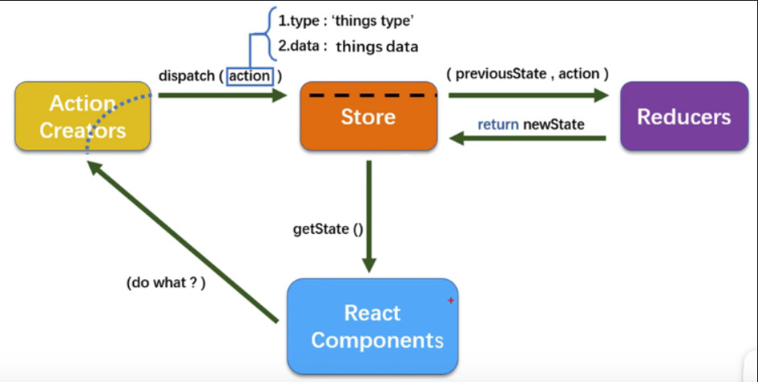

#  Redux

## Introduction

We have now begun learning Redux. In our previous case examples, state management was primarily achieved through the `state`. For example, when passing data between sibling components, we had to pass data to the parent component first, and then have the parent forward it to its child components. This process was quite complicated. Later, we learned about **message-based publish-subscribe**, and we used the **pubsub** library to implement message forwarding, where data could be published, and sibling components could subscribe to it. This allowed for easier data transfer between sibling components. However, as our requirements grew more complex, we needed even more sophisticated data transfer methods and multi-layered data exchange. 

**So why not centralize all data in a hub outside of all components, and let this hub handle data distribution? This way, any component that needs data can easily retrieve it.**

There is a library that helps us achieve this, and that is Redux. It allows us to implement centralized state management.

## 1. Overview

> [Redux – Li Lichao | lilichao.com](https://www.lilichao.com/index.php/2022/05/22/redux/)
>
> Explanation by Li Lichao

The official description of Redux is "A Predictable State Container for JS Apps." This can be translated as "a predictable state container designed for JS applications." In simple terms, Redux is a predictable state container. But what does this mean exactly? Let’s break it down step by step.

### 1.1 State

A state is simply a variable used to record the state of a component. We are already familiar with state after using React for some time. For example, a state might represent whether a user is logged in or not, which determines what is displayed on the page. In another case, a state might control whether data has been loaded, thus determining how the interface is displayed.

Importantly, states are not exclusive to React or similar frameworks. All programming languages have states, and they are used to execute different logic based on different conditions. Therefore, a state is essentially a variable that records the current execution state of the program.

### 1.2 Container

A container is used to hold things, and a state container is designed to store states. When there are many states, you need something to store them. However, the container does more than just store states; it acts as a state manager. It allows you to query, modify, and manage the state in various ways.

### 1.3 Predictable

Predictable means that every operation on the state will yield consistent results. If you perform the same operations in the same order, you will always get the same outcome. In Redux, all operations on the state are encapsulated within the container. External code can only interact with the state through the container's methods, not by directly modifying the state. This ensures that state operations are controlled and thus predictable.

In summary, **Redux is a stable and secure state manager**.

## 2. Why Redux?

Question: Isn't React's state enough? Why introduce Redux as a state manager?

Answer: React's `state` works fine for simple data, but it becomes inconvenient when dealing with complex data.

Question: Can't we use `useReducer` for complex data?

Answer: Yes, `useReducer` can help. But even with `state` or `useReducer`, passing data can still be inconvenient, as it requires passing it down through multiple layers.

Question: What about `context`?

Answer: `Context` can solve the problem of passing `state`, but for complex data structures, it can become bulky and difficult to maintain.

Redux can be seen as a combination of `reducer` and `context`. It allows you to manage complex state and easily share it across different components. Redux is primarily used in large-scale applications where the state is more complex. If you only rely on `reducer` and `context`, development becomes less efficient, and a powerful state manager like Redux becomes essential.

## 3. When to Use Redux

First, let's clarify the role of `Redux`, which is to implement centralized state management.

`Redux` is best suited for scenarios involving complex interactions or multiple data sources. In simple terms, it’s designed for **complex** applications.

From a component perspective, you may want to use `Redux` in the following situations:

1. When a component's state needs to be shared.
2. When one component needs to change the state of another.
3. When a component needs to modify the global state.

In addition to these cases, there are many other situations where Redux is beneficial.



As shown in the diagram above, `Redux` centralizes all `state` at the top of the component hierarchy, making it easy to distribute the required `state` to any component.

The three principles of `redux` are:

- All of the application’s `state` is stored in a single `object tree` within a unique `store`. (This doesn't mean that every `state` must be placed in `redux`; components can still manage their own `state`).
- `State` is read-only. Any changes to the `state` lead to changes in the view. Users cannot directly access the `state`; they interact with the view, and only by triggering an `action` can the `state` be changed. An `action` is a simple object that describes an event.
- `Reducers` are used to execute `state` updates. A `reducer` is a pure function that takes the current `state` and an `action` as inputs and returns a new `state` based on the action, thereby triggering a view update.

## 4. Redux Workflow


As shown in the diagram above, the general Redux workflow is as follows:

- First, the user dispatches an `action` using the `store.dispatch` method from the view.
- Then, the `store` automatically calls the `reducers`, passing in two arguments: the current `state` and the `action` that was dispatched. The `reducers` return a new `state`.
- Finally, when the `store` detects a change in the `state`, it calls the listener function to trigger a re-render of the view.

## 5. Redux API

### 5.1 Store

- The `store` is where the state is saved, and there should only be one `store` for the entire application.
- Redux provides the `createStore` function to create a `store` that holds the entire application’s `state`.
```js
import { createStore } from 'redux';
const store = createStore(reducer, [preloadedState], enhancer);
```

### createStore in Redux

The `createStore` function is used to create a container object in Redux. It requires three parameters: `reducer`, `preloadedState`, and `enhancer`.

- **`reducer`**: A function that acts as the integrator of state operations. Every time the state is modified, this function is triggered, and its return value becomes the new state.

- **`preloadedState`**: This represents the initial value of the state. You can specify it here or within the reducer.

- **`enhancer`**: An enhancer function used to extend the functionality of the state. For now, we can ignore this parameter.

### 5.2 State

- The `store` object holds all the data. If you want to capture a snapshot of the data at a specific moment, you need to generate a snapshot of the `store`. This snapshot of data at a given time is referred to as `state`.
  
- To get the current `state`, you can use the `store.getState()` method:
```js
import { createStore } from 'redux';
const store = createStore(reducer, [preloadedState], enhancer);

const state = store.getState();
```
### 5.3 Action

- Changes in the `state` lead to changes in the view. However, the user doesn't directly interact with the `state` but only with the view. Therefore, any changes to the `state` must be initiated by the view.

- An `action` is a notification sent from the view to the `store`, signaling that the `state` should change.

- An `action` is simply an object. The `type` property is mandatory and represents the name of the action. Other properties can be freely defined. There is a community standard that can be referred to for structuring actions:
```js
const action = {
  type: 'ADD_TODO',
  payload: 'Learn Redux' 
};
```

In the code above, an `action` named `ADD_TODO` is defined, and it carries the data `Learn Redux`.

### 5.4 Action Creator

- For each message the view sends, there will be a corresponding `action`. Manually writing all these `actions` can be cumbersome.

- You can define a function to generate these `actions`, and this function is called an `Action Creator`. For example, in the code below, the `addTodo` function serves as an `Action Creator`:


```js
const ADD_TODO = 'add TODO';

function addTodo(text) {
  return {
    type: ADD_TODO,
    text
  }
}
const action = addTodo('Learn Redux');
```

- `redux-actions` is a utility library that simplifies writing `redux` state management. This library provides a `createAction` method for creating action creators:

```javascript
import { createAction } from "redux-actions"

export const INCREMENT = 'INCREMENT'
export const increment = createAction(INCREMENT)
```
- In the code above, an action `INCREMENT` is defined, and the corresponding `Action Creator` is created using `createAction`:

  - Calling `increment()` will return `{ type: 'INCREMENT' }`.
  - Calling `increment(10)` will return `{ type: 'INCREMENT', payload: 10 }`.

### 5.5 store.dispatch()

```js
import { createStore } from 'redux';
const store = createStore(reducer, [preloadedState], enhancer);

store.dispatch({
  type: 'ADD_TODO',
  payload: 'Learn Redux'
});
```
- Combined with the `Action Creator`, the previous code can be rewritten as follows:

```js
import { createStore } from 'redux';
import { createAction } from "redux-actions"
const store = createStore(reducer, [preloadedState], enhancer);

const ADD_TODO = 'ADD_TODO';
const add_todo = createAction('ADD_TODO'); Creator

store.dispatch(add_todo('Learn Redux'));
```

- After the `store` receives an `action`, it must produce a new `state` so that the view can update. The calculation (update) process of the `state` is implemented through a **reducer**.
  
- A **reducer** is a function that accepts the current `state` and an `action` as parameters and returns a new `state`:

```javascript
const reducer = function (state, action) {
  // ...
  return new_state;
};
```
- To ensure that the `reducer` function is automatically executed when calling the `store.dispatch` method, the `reducer` needs to be passed into the `createStore` function when creating the `store`:

```javascript
import { createStore } from 'redux';
const reducer = function (state, action) {
  // ...
  return new_state;
};
const store = createStore(reducer);
```

- In the code above, the `createStore` method accepts the `reducer` as a parameter to generate a new `store`. From then on, whenever the view sends a new `action` to the `store` via `store.dispatch`, the `reducer` function will automatically be called to update the `state`.

- The `redux-actions` library provides a `handleActions` method to handle multiple `actions` more conveniently:

```javascript
// handleActions(reducerMap, defaultState)

import { handleActions } from 'redux-actions';
const initialState = { 
  counter: 0 
};

const reducer = handleActions(
  {
    INCREMENT: (state, action) => ({
      counter: state.counter + action.payload
    }),
    DECREMENT: (state, action) => ({
      counter: state.counter - action.payload
    })
  },
  initialState,
);
```