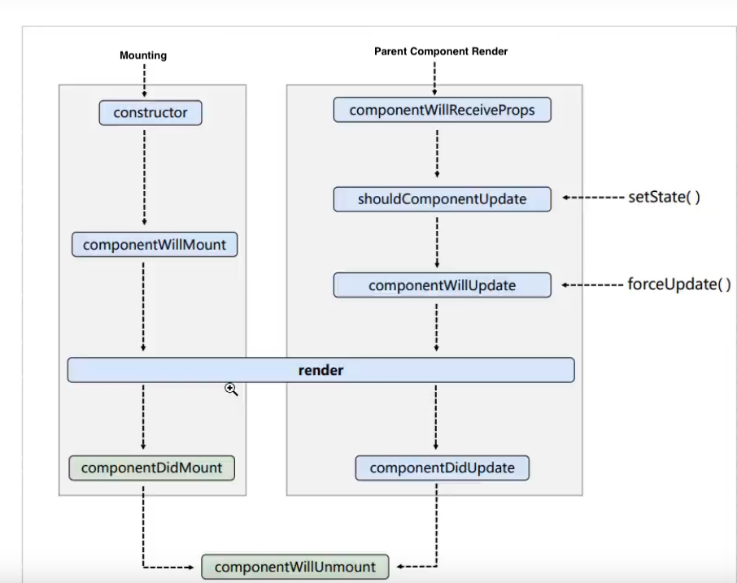
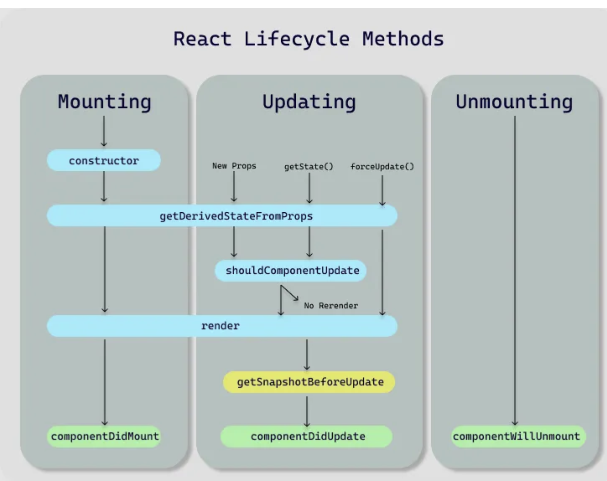

# Introduction to React

## What is React?

React is a JavaScript library used for building user interfaces. It’s an open-source library that renders data as HTML views.

## Why Learn React?

1. Native JavaScript operations on the DOM are cumbersome and inefficient.
2. Directly manipulating the DOM with JavaScript leads to extensive browser reflow and repaint processes.
3. Native JavaScript lacks a component-based coding approach, resulting in low code reusability.

## Basic React Example

### 1. Import Required Packages

First, you need to import the following three packages:

- `react.development.js`
- `react-dom.development.js`
- `babel.min.js`

Make sure to import them in this order:

```html
<script src="../js/react.development.js" type="text/javascript"></script>
<script src="../js/react-dom.development.js" type="text/javascript"></script>
<script src="../js/babel.min.js" type="text/javascript"></script>
```
### 2. Create a Container
Next, create a container in your HTML where the React component will be rendered.


### 3. Create a Virtual DOM and Render It
Now, create a virtual DOM using JSX and render it to the container.

```html
<body>
    <!-- Prepare the container -->
    <div id="test"></div>

    <!-- Include the dependencies, in this specific order -->
    <script src="../js/react.development.js" type="text/javascript"></script>
    <script src="../js/react-dom.development.js" type="text/javascript"></script>
    <script src="../js/babel.min.js" type="text/javascript"></script>

    <!-- Use Babel to parse JSX syntax -->
    <script type="text/babel">
        // 1. Create a virtual DOM
        const VDOM = <h1>Hello</h1>; // Using JSX syntax

        // 2. Render the virtual DOM into the container
        // If multiple renderings target the same container, the last one will overwrite the previous ones.
        ReactDOM.render(VDOM, document.getElementById("test"));
    </script>
</body>
```

# JSX Basic Syntax

1. **Define a Virtual DOM**: Do not use quotes `""` when defining a virtual DOM.
2. **Embed JavaScript Expressions**: Use `{}` to embed JavaScript expressions within tags.
3. **Class Names**: Use `className` instead of `class` to specify class names.
4. **Inline Styles**: Use double curly braces `{{}}` to wrap inline styles.
5. **Single Root Element**: There can be only one root element; multiple root elements are not allowed.
6. **Tag Closure**: Tags must be properly closed.
7. **Tag Name Convention**:
   - Lowercase tag names are converted to HTML elements. If the element doesn't exist in HTML, an error will be thrown.
   - Uppercase tag names are treated as React components. If the component doesn't exist, an error will be thrown.

### JSX Expressions vs JSX Statements

- **JSX Expressions**: Return a value and can be used anywhere a value is required (e.g., `a`, `a+b`, `demo(a)`, `arr.map()`, `function text(){}`).
- **JavaScrJSXipt Statements**: Do not return a value (e.g., `if(){}`, `for(){}`, `while(){}`, `switch(){}`).

### Example:

```html
<!DOCTYPE html>
<html lang="en">
<head>
    <meta charset="UTF-8">
    <meta name="viewport" content="width=device-width, initial-scale=1.0">
    <title>Document</title>
    <style>
        .sss {
            color: red;
        }
    </style>
</head>
<body>
    <!-- Prepare the container -->
    <div id="test"></div>

    <!-- Include dependencies in this order -->
    <script src="../js/react.development.js" type="text/javascript"></script>
    <script src="../js/react-dom.development.js" type="text/javascript"></script>
    <script src="../js/babel.min.js"></script>

    <!-- Create a Virtual DOM using JSX -->
    <script type="text/babel">
        const MyId = "title";
        const MyData = "Cyk";
        // 1. Create a virtual DOM
        const VDOM = (
            <h1 id={MyId.toLocaleUpperCase()}>
                <span className="sss" style={{ fontSize: '50px' }}>sss</span>
            </h1>
        );
        // 2. Render the virtual DOM
        ReactDOM.render(VDOM, document.getElementById("test"));
    </script>
</body>
</html>

```
### Creating Virtual DOM: Two Methods

### 1. Using JSX:
```html
const VDOM = (
    <h1 id={MyId.toLocaleUpperCase()}>
        <span className="sss" style={{ fontSize: '50px' }}>sss</span>
    </h1>
);
```
This method was demonstrated in the example above.

### 2. Using JSX:
```html
// Create a virtual DOM using JSX
const VDOM = React.createElement('h1', { id: "title" }, "nihao");
```
Both JSX and JavaScript can create a virtual DOM, but JSX is generally preferred as it is less cumbersome, especially when dealing with multiple tags.

# Components

Components are the building blocks of a React application. When an application is built using multiple components, it is called a component-based application.

### Important Notes:

Component Naming: Component names must start with an uppercase letter.
React treats components that start with lowercase letters as native DOM elements. For example, `<div />` represents an HTML div tag, while `<Welcome />` represents a React component.

Props: Passed parameters cannot be modified within the component.

## Functional Components
### 1. Create a function. The function can take parameters and must return a virtual DOM:

```html
function Welcome(props) {
  return <h1>Hello, {props.name}</h1>;
}
```

### 2. Render the component:
```html
ReactDOM.render(<Welcome name="ss" />, document.getElementById("div"));
```
ReactDOM.render() is called with `<Welcome name="Sara" />` as an argument.
React calls the `Welcome` component, passing `{name: 'Sara'}` as `props`.
`Welcome` returns a `Hello, Sara` element.
ReactDOM efficiently updates the DOM to display `Hello, Sara`.

## Class Components
Class components must extend React.Component.
The render() method must be overridden and return a virtual DOM.

```html
class Welcome extends React.Component {
  render() {
    return <h1>Hello, {this.props.name}</h1>;
  }
}

ReactDOM.render(<Welcome name="ss" />, document.getElementById("div"));

```
Execution Process:
React parses the component tag and finds the corresponding class component.
It instantiates the class and calls the `render` method.
The `render` method returns the virtual DOM, which is then converted into a real DOM and displayed on the page.

### Component Example
Here’s an example of how components can be used together, focusing on the core code:

```html
<script type="text/babel">
    // Create a <li> component
    function GetLi(props){      
        return <li>{props.value}</li>;
    }

    // Create a class component <ul>
    class MyComponent extends React.Component {
        render() {
            let com = this.props.arr.map((item, index) =>
                // Include the <GetLi> component, passing a unique key for each item
                <GetLi value={item} key={index} />
            );
            return <ul>{com}</ul>;
        }
    }

    let num = [1, 2, 3, 4];
    // Render the component
    ReactDOM.render(<MyComponent arr={num} />, document.getElementById("test"));
</script>
```

### Key Points:
Components can be nested within each other.

When creating arrays of elements, each element should have a unique `key`.

`key` helps React identify which items have changed, been added, or removed.


# Core Properties of React Component Instances

## State

`state` is a crucial part of React components, representing the internal data that drives the component's rendering. React is often described as a `state` machine because it updates the UI based on changes in `state`. When `state` changes, React re-renders the component, ensuring that the UI reflects the current `state`.

Example: Display "The weather is hot today" on the page, and when clicked, change it to "The weather is cool today."

```html
class Weather extends React.Component {
    state = { isHot: true };

    toggleWeather = () => {
        this.setState({ isHot: !this.state.isHot });
    };

    render() {
        return (
            <h1 onClick={this.toggleWeather}>
                The weather is {this.state.isHot ? "hot" : "cool"} today.
            </h1>
        );
    }
}

ReactDOM.render(<Weather />, document.getElementById('root'));

```


## 1. Props and State

- **Props**: Props are the input parameters for a component, passed down from a parent component. They are immutable and determine the behavior and appearance of the component.
- **State**: State is the data managed internally by a component. It can be changed, allowing the component to dynamically respond to user input or other changes.

## 2. `this` Keyword

- In React class components, `this` refers to the component instance. However, because class methods run in strict mode, `this` may be `undefined` when called directly.
- To ensure `this` references the correct instance, use arrow functions when defining methods.

## 3. Modifying State with `setState`

- To update the state, use the `setState` method. This method accepts either an object or a function.
  - **Object**: Directly updates the specified state properties.
  - **Function**: Takes the current state and props as arguments and returns an object representing the new state. This method is useful when the new state depends on the previous state.
  
### Example of Object Update:
```javascript
this.setState((prevState, props) => ({
  isHot: !prevState.isHot
}));
```


### Key Points:

Updating State: 

    Use setState to update state. Direct modification won't trigger re-rendering.

Asynchronous Updates:

    React may batch multiple setState calls into a single update for performance reasons. The state might not immediately reflect the updated values right after a setState call.


### Props


**Props** (short for "properties") are used to pass data between components in React. Props are immutable, meaning they cannot be changed once set, and are primarily used for rendering dynamic content in components.

### 1. Basic Usage Example:

```html
<body>
    <div id="root"></div>
</body>

<script type="text/babel">
    class Person extends React.Component {
        render() {
            return (
                <ul>
                    <li>{this.props.name}</li>
                    <li>{this.props.age}</li>
                    <li>{this.props.sex}</li>
                </ul>
            );
        }
    }
    // Passing data via props
    ReactDOM.render(<Person name="Tom" age="41" sex="Male" />, document.getElementById('root'));
</script>


const personData = { name: "Tom", age: 41, sex: "Male" };
ReactDOM.render(<Person {...personData} />, document.getElementById('root'));
```

### 2. Passing Objects as Props:

If the data to be passed is an object, the spread operator (...) can be used to simplify the code:

```html
<script type="text/babel">
    class Person extends React.Component {
        render() {
            return (
                <ul>
                    <li>{this.props.name}</li>
                    <li>{this.props.age}</li>
                    <li>{this.props.sex}</li>
                </ul>
            );
        }
    }

    const person = { name: "Jack", age: "18", sex: "Female" };
    ReactDOM.render(<Person {...person} />, document.getElementById('root'));
</script>

```

### 3. The Spread Operator (...)
The spread operator is not only used for arrays but also has other useful applications:

### 3.1 Copying Objects

```javascript
const original = { name: "Jack", age: "18", sex: "Female" };
const copy = { ...original };
original.name = "Ted";
console.log(copy);  // { name: "Jack", age: "18", sex: "Female" }
```
In this case, `copy` is a new object, and changes to original do not affect it.

### 3.2 Merging Objects
```javascript
const original = { name: "Jack", age: "18", sex: "Female" };
const merged = { ...original, name: "Ted", hobby: "Photography" };
console.log(merged);  // { name: "Ted", age: "18", sex: "Female", hobby: "Photography" }
```


### 4. Validating `Props` with `propTypes` and `defaultProps`
React allows you to validate the types of props to avoid unexpected behavior

### 4.1 propTypes: Type Checking

```javascript
class Person extends React.Component {
    static propTypes = {
        name: PropTypes.string.isRequired,  // `name` must be a string and is required
        sex: PropTypes.string,  // `sex` must be a string
        speak: PropTypes.func   // `speak` must be a function
    };

    static defaultProps = {
        sex: "Not Specified",  // Default value for `sex`
        age: 18  // Default value for `age`
    };

    render() {
        return (
            <ul>
                <li>{this.props.name}</li>
                <li>{this.props.age}</li>
                <li>{this.props.sex}</li>
            </ul>
        );
    }
}

ReactDOM.render(<Person name="Ted" age={14} speak={speak} />, document.getElementById('root'));

function speak() {
    console.log("This is a function");
}

```

### 4.2 `defaultProps`: Setting Default Values
`defaultProps` allows you to define default values for props that are not provided:

```javascript
static defaultProps = {
    sex: "Not Specified",  // Default value for `sex`
    age: 18  // Default value for `age`
};
```

### 5. Functional Components
In functional components, props are used as function arguments:
```javascript
function Person(props) {
    return (
        <ul>
            <li>{props.name}</li>
            <li>{props.age}</li>
            <li>{props.sex}</li>
        </ul>
    );
}

```

## Refs

Refs provide a way to access DOM nodes or React elements that are created in the `render` method.

Types of Refs

React offers three main ways to create refs:


### 1. String Refs
You can directly add a ref attribute to a DOM node to access it later. This method stores the DOM element in the component's refs object, allowing you to access the node through this.refs.

```javaScript
<input ref="dian" type="text" placeholder="Click to alert" />

inputBlur = () => {
    alert(this.refs.dian.value);
}

```

### 2. Callback Refs

With callback refs, you can pass a function as the `ref` attribute. The function receives the DOM element as its argument, allowing you to store it in a component property.

```javaScript
<input ref={self => { this.dian = self; console.log(self); }} placeholder="Click to alert" />
```

You can also extract the function and reference it:

```javaScript
isRef = (self) => {
    this.dian = self;
    console.log(self);
}

<input ref={this.isRef} type="text" placeholder="Click to alert" />
```

Note:
In React, there is a subtle difference with the callback ref method. When the component's state is updated and triggers a re-render, the function defined in the ref will be called twice. The first call passes null for initialization, and the second call passes the node information. Defining the ref function within the class can prevent it from being called twice during a re-render.

### 3. API Refs

React provides a built-in API for creating refs, which automatically assigns the DOM element to a `current` property of the ref object. Each ref needs to be created with this API and attached to the desired DOM node

```javaScript
MyRef = React.createRef();
MyRef1 = React.createRef();

<input ref={this.MyRef} type="text" placeholder="Click to alert" />
<input ref={this.MyRef1} type="text" placeholder="Click to alert" />

btnOnClick = () => {
    console.log(this.MyRef.current.value);
}
```

## Controlled and Uncontrolled Components in React

### Controlled Components

Controlled components in React refer to form elements whose values are controlled by the React state. In this approach, the React component renders the form and also manages the user input, making the React state the "single source of truth" for the form data.

### Example:
```javascript
saveName = (event) => {
    this.setState({ name: event.target.value });
}

savePwd = (event) => {
    this.setState({ pwd: event.target.value });
}

render() {
    return (
        <form action="http://www.baidu.com" onSubmit={this.login}>
            Username: <input value={this.state.name} onChange={this.saveName} type="text" />
            Password: <input value={this.state.pwd} onChange={this.savePwd} type="password" />
            <button>Login</button>
        </form>
    );
}

```

### Uncontrolled Components

Uncontrolled components, on the other hand, allow form elements to maintain their own internal state without updating the React state. The data entered by the user is accessed only when needed, typically via a `ref`.

```javascript
class Login extends React.Component {

    login = (event) => {
        event.preventDefault(); // Prevent form submission
        console.log(this.name.value);
        console.log(this.pwd.value);
    }

    render() {
        return (
            <form action="http://www.baidu.com" onSubmit={this.login}>
                Username: <input ref={self => this.name = self} type="text" name="username" />
                Password: <input ref={self => this.pwd = self} type="password" name="password" />
                <button>Login</button>
            </form>
        );
    }
}
```
# React Component Lifecycle

React components go through several specific stages from creation to termination. Throughout these stages, React provides a series of lifecycle hook functions (also known as lifecycle methods) that are called at particular moments. By defining components, we can perform specific tasks at these particular points in the component's lifecycle.

## Old Lifecycle Structure

In the old version of React, the component lifecycle is divided into three main phases:

1. **Mounting** - When the component is being inserted into the DOM.
   - `constructor()`
   - `componentWillMount()` (deprecated)
   - `render()`
   - `componentDidMount()`

2. **Updating** - When the component is being re-rendered as a result of changes to its props or state.
   - `componentWillReceiveProps(nextProps)` (deprecated)
   - `shouldComponentUpdate(nextProps, nextState)`
   - `componentWillUpdate(nextProps, nextState)` (deprecated)
   - `render()`
   - `componentDidUpdate(prevProps, prevState)`

3. **Unmounting** - When the component is being removed from the DOM.
   - `componentWillUnmount()`

These lifecycle methods provide a powerful way to execute code at specific stages of a component’s existence. However, some methods have been deprecated in newer versions of React, as the React team has introduced more efficient patterns and hooks.

### Deprecated Lifecycle Methods:
- `componentWillMount()`
- `componentWillReceiveProps(nextProps)`
- `componentWillUpdate(nextProps, nextState)`

These methods have been deprecated in favor of more robust alternatives in the new lifecycle methods introduced in React 16.3 and beyond.

**Note:** If you are using an older version of React, you may encounter these lifecycle methods, but it's recommended to upgrade to the latest version of React and adopt the new lifecycle methods.

## Old Lifecycle Diagram

Below is a diagram illustrating the old structure of the React component lifecycle:




## React Component Lifecycle (Latest Version)

In the latest versions of React, certain lifecycle hooks have been deprecated. According to the official React documentation:

> **The most important lesson we've learned is that outdated lifecycle methods often lead to unsafe coding practices.**

The specific lifecycle methods that have been deprecated are:

- `componentWillMount`
- `componentWillReceiveProps`
- `componentWillUpdate`

These lifecycle methods are often misunderstood and misused. Moreover, we anticipate that their potential for misuse could be even greater with the introduction of asynchronous rendering in future versions of React. Therefore, in upcoming versions, these lifecycle methods will be prefixed with `UNSAFE_`. (Here, "unsafe" does not refer to security but rather indicates that code using these lifecycle methods is more likely to contain bugs in future versions of React, especially when asynchronous rendering is enabled.)

### Deprecated Methods in New Versions:

- `UNSAFE_componentWillMount`
- `UNSAFE_componentWillReceiveProps`
- `UNSAFE_componentWillUpdate`

Although these methods with the `UNSAFE_` prefix are still available, React's official recommendation is to avoid using them. There is a possibility that these methods will be completely removed in future versions.

### New Lifecycle Diagram



### Differences Between Old and New React Lifecycles

From the updated lifecycle diagram, we can observe the following key differences between the old and new React lifecycle:

### 1. Deprecated Lifecycle Methods
The following three lifecycle hooks have been deprecated:
- `componentWillMount`
- `componentWillReceiveProps`
- `componentWillUpdate`

These methods are still available, but it's recommended to avoid using them as they might be removed in future React versions.

### 2. Introduction of New Lifecycle Methods
Two new lifecycle methods have been introduced in the updated React lifecycle:

#### `static getDerivedStateFromProps(props, state)`
- **When it's called:** This method is invoked right before calling the `render` method, both during the initial mounting and subsequent updates.
- **Characteristics:**
  - It must be declared as a static method.
  - It receives the component's props and state as arguments.
  - It must return a value, which can either be `null` or an object representing the new state.
  - Since this method is called on both initialization and updates, returning a new state object will overwrite the existing state. Therefore, modifying the state within this method will not work as expected.

#### `getSnapshotBeforeUpdate(prevProps, prevState)`
- **When it's called:** This method is invoked right before the most recently rendered output is committed to the DOM.
- **Purpose:** It allows your component to capture some information from the DOM (e.g., scroll position) before it potentially changes.
- **Return Value:** Any value returned by this method will be passed as a parameter to `componentDidUpdate()`.

### Example of using getSnapshotBeforeUpdate()

Continuously outputs content in a fixed area

```javascript
  class New extends React.Component{

        state = {num:[]};

        componentDidMount(){
            setInterval(()=>{
                let {num} = this.state;
                const news = num.length + 1;
                this.setState({num:[news,...num]})
            },500)
        }

        getSnapshotBeforeUpdate(){
            return this.refs.list.scrollHeight;
        }

        componentDidUpdate(preProps,preState,height){
            this.refs.list.scrollTop += (this.refs.list.scrollHeight - height);
        }


        render(){
            return (

                <div ref = "list" className = "list">{
                    this.state.num.map((n,index)=>{
                    return <div className="news" key={index} >Article {n}</div>
                    })
                }</div>
            )
        }

    }
```

# Diff Algorithm in React

## Overview

The Diff algorithm in React is a crucial aspect of how React manages updates to the user interface efficiently. Understanding the concept of `key` in React is essential when discussing the Diff algorithm.

### Keys in React

Each element in a React component typically has a `key` attribute. While some keys must be explicitly defined, others can be implicit.

- **Static Content**: If the content generated by `render` is static and won't change, there's no need to specify a `key`. React will automatically generate a default identifier.
- **Dynamic Content**: If your elements are dynamic and may be updated, you must explicitly define a `key`. For example, when rendering a list using `map`, each item should have a unique `key`.

```jsx
this.state.num.map((n, index) => {
  return <div className="news" key={index}>article {n}</div>
});
```

### Efficiency Concerns with Keys

Although it's possible to use the array index as a key, the official React documentation does not recommend this practice because it can lead to efficiency issues.

Example Scenario: Inefficient Key Usage
Consider an array of objects representing people:

```jsx
person: [
  {id: 1, name: "Jack", age: 18},
  {id: 2, name: "Ted", age: 19}
]

this.state.person.map((person, index) => {
  return <li key={index}>{person.name}</li>;
});

<button onClick={this.addObject}>click to add a person</button>

addObject = () => {
  let { person } = this.state;
  const p = { id: person.length + 1, name: "Kuan", age: 20 };
  this.setState({ person: [p, ...person] });
};

```


At first glance, this functionality seems to work fine. However, it can lead to performance issues. Let's examine the changes in the component's state before and after:

1. **Initial Order**: The objects are ordered as Jack, Ted.
2. **After Adding a New Object**: The order becomes Kuan, Jack, Ted.

Since we're using the `index` as the `key`, the keys for these elements change:

- Jack's original key was `0`, now it becomes `1`.
- Ted's original key was `1`, now it becomes `2`.
- Kuan becomes `0`.

When React re-renders the component, it checks whether the old virtual DOM matches the new virtual DOM based on the `key`:

- **key = 0**: Old virtual DOM content was Jack; new virtual DOM is Kuan. React considers this a change and recreates the real DOM.
- **key = 1**: Old virtual DOM content was Ted; new virtual DOM is Jack. React considers this a change and recreates the real DOM.
- **key = 2**: The old virtual DOM did not exist; a new real DOM is created.

Even though two virtual DOM elements could have been reused, React recreates everything due to the `key` changes, leading to significant performance degradation.

This problem occurs because we added the new object to the beginning of the array. Adding it to the end would avoid this issue. However, to avoid potential problems, it's recommended to use a unique identifier (like `id`) as the `key` instead of `index`.

### Issues with Using Index as Key

1. **Reversing or altering the data order**:
   - This can cause unnecessary real DOM updates. While the UI might look correct, the performance can suffer.

2. **Input elements within the structure**:
   - Incorrect DOM updates can occur, leading to UI issues.

3. **If the data order is not altered**:
   - Using the `index` as the key is generally acceptable for rendering lists where the data order is consistent.

### Choosing the Right Key

- Ideally, use a unique identifier for each data item as the `key` (e.g., `id`, phone number, or ID card number).
- If you're sure the data is only used for display and the order won't change, using the `index` as the `key` is acceptable.

### The Role of the Diff Algorithm

The Diff algorithm in React is responsible for comparing the new virtual DOM with the previous one:

- **If a matching key is found in the old virtual DOM**:
  - If the content hasn't changed, React reuses the old real DOM.
  - If the content has changed, React creates a new real DOM.

- **If no matching key is found**:
  - React creates a new real DOM and renders it on the page.


